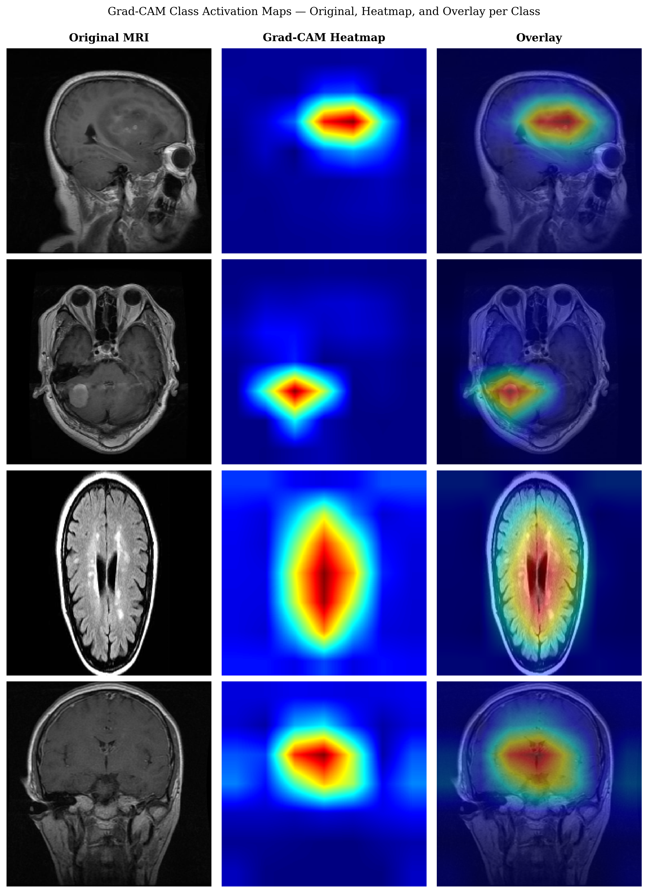

# 🧠 Neuro-Oncology AI Platform

### Brain Tumor Diagnosis System using Deep Learning

---

## 🚀 Overview

This project is a **full-stack AI-powered medical imaging system** designed to assist in brain tumor diagnosis using MRI scans.

It performs:

* ✅ Tumor Classification (Glioma, Meningioma, Pituitary, No Tumor)
* ✅ Tumor Segmentation (pixel-level masks)
* ✅ Explainability (Grad-CAM heatmaps)
* ✅ Uncertainty Estimation
* ✅ Clinical Feature Extraction (volume, WHO grade)

---

## 🧠 Models Used

* **EfficientNet-B0** → Classification
* **YOLOv10** → Tumor Localization
* **MobileSAM** → Segmentation
* **Grad-CAM** → Explainability
* **MC Dropout** → Uncertainty Estimation

---

## 📊 Performance

* **Accuracy:** 95.5%
* **Macro F1 Score:** 0.954
* **Segmentation IoU Improvement:** +27.6%

---

## 💡 Key Innovation

### 🔬 Grad-CAM Guided SAM Prompting

This system uses Grad-CAM heatmaps to guide segmentation by providing spatial prompts to SAM, significantly improving tumor boundary detection accuracy.

---

## 🏗️ System Architecture

* **Backend:** FastAPI
* **Frontend:** React + WebSockets
* **ML Framework:** PyTorch
* **Image Processing:** OpenCV, NumPy

---

## 📸 Sample Outputs

### 🔥 Grad-CAM Visualization



### 🧩 Tumor Segmentation


---

## ⚙️ How to Run

### 1️⃣ Clone Repository

```bash
git clone https://github.com/vaishhingmire/Neuro-Oncology-AI-Platform-Brain-Tumor-Diagnosis-System.git
cd Neuro-Oncology-AI-Platform-Brain-Tumor-Diagnosis-System
```

### 2️⃣ Install Dependencies

```bash
pip install -r requirements.txt
```

### 3️⃣ Run Backend

```bash
cd backend
uvicorn main:app --reload
```

---

## 📦 Model Weights

Due to GitHub size limitations, trained model files are not included in this repository.

👉 Download models here:
**[Paste your Google Drive link here]**

After downloading, place them inside:

```
backend/models/
```

---

## 📄 Research Work

Paper submitted to Conference (ICSIE 2026)

---

## 👩‍💻 Author

**Vaishnavi Hingmire**
M.Tech Computer Engineering
Mumbai, India
